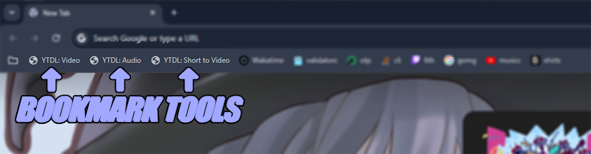

# tools-bookmarks
A collection of personal scripts that can be run from the bookmarks bar.

# Bookmarks
In Chrome you can follow these instructions to set up a bookmark:

`Right click empty space in Bookmarks Bar > Add Page > Paste Name > Paste URL`

> 🛈 Ensure the bookmark is under to **Bookmarks bar** so it can be easily accessed.

| Name                 | Description                                         | URL                                                                                                                   |
| :------------------- | :-------------------------------------------------- | :-------------------------------------------------------------------------------------------------------------------- |
| YTDL: Audio          | Downloads MP3 Audio for a YouTube Video             | `javascript:window.location.href = "http://localhost:1273/youtube/download?type=audio&url=" + window.location.href`   |
| YTDL: Video          | Downloads MP4 or WEBM Video for a YouTube Video     | `javascript:window.location.href = "http://localhost:1273/youtube/download?type=video&url=" + window.location.href`   |
| YTDL: Short to Video | Redirects you to the Video page for a YouTube Short | `javascript:window.location.replace('https://www.youtube.com/watch?v=%27+window.location.href.split(%27/%27).at(-1))` |